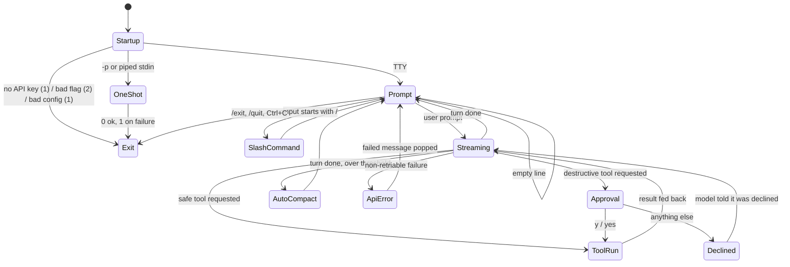

# App Flow — TerminalAgent

**Date:** 2026-08-03 · **PRD:** [PRD.md](PRD.md) · **TDD:** [TDD.md](TDD.md)

> The interface is a terminal REPL plus a one-shot pipe mode. "Screen" below means
> a distinct state of the terminal, not a page. Every string quoted here is from
> `src/index.ts`; the transcript in the README is the real thing, captured from the
> built binary.

## Entry points

| How you arrive | What happens |
|---|---|
| `npm start` / `terminal-agent` | Interactive REPL |
| `terminal-agent -p "<prompt>"` | One-shot: answer to stdout, tool activity to stderr, then exit |
| `echo "<prompt>" \| terminal-agent` | Same one-shot path — chosen automatically when stdin is not a TTY |
| `terminal-agent --resume <name>` | REPL seeded from `.mentor/sessions/<name>.json` |
| `--help` / `--version` | Print and exit 0, **before** the API-key check, so neither needs a key |

Startup is ordered so the cheapest rejections come first: parse argv → help/version
→ argv errors (exit **2**) → `ANTHROPIC_API_KEY` present (exit **1**) → load config
(exit **1** on malformed `.mentorrc.json`) → build the system prompt → run.

## The happy path

1. **Banner.** Name and version, the resolved model, the working directory,
   `Loaded project memory (MENTOR.md / AGENTS.md)` if one was found, a yellow
   `AUTO-APPROVE is ON` line if the gate is off, and `Type /help for commands`.
2. **Prompt.** A green `> `. The user types a request in plain English.
3. **Streaming reply.** A cyan `TerminalAgent: ` label, then the model's text
   streamed token by token as it arrives.
4. **Tool call.** A yellow `[tool: edit_file] greet.js`. For `edit_file` and
   `write_file` a coloured unified diff of exactly what will change follows —
   green `+`, red `-`, dim context, long unchanged runs folded as
   `… (N unchanged lines)`. For `bash`, the **full untruncated command**, plus a
   risk banner when the classifier rates it above normal.
5. **Approval.** `⚠ Run edit_file? greet.js  [y/N] `. Only `y` or `yes`
   (case-insensitive, trimmed) approves. Empty, `n`, or anything else declines,
   and the model is told `User declined to run this action.` and carries on.
6. **Result.** `✓` and the first three lines of output in dim, with
   `… (N lines)` when there is more; or `✗` and the first five lines in red.
7. **Loop.** Steps 3–6 repeat until the model stops requesting tools.
8. **Auto-compact check.** If measured context has crossed the threshold, a yellow
   notice and an in-place compaction, then back to the prompt.

## Every state of every surface

| Surface | Loading | Empty | Populated | Error | Unauthorised | Slow |
|---|---|---|---|---|---|---|
| **REPL prompt** | n/a | Blank line just re-prompts, no complaint | `> ` | — | — | — |
| **Model turn** | Text streams as it arrives — no spinner needed, the tokens *are* the progress indicator | Model returns no text: the turn simply ends | Streamed text + tool blocks | `API Error <status>: <message>` in red, the failed user message popped so it can be retried | 401 surfaces as an API error with the status | Retried up to 3× with exponential backoff (500ms, 1s, 2s), each announced as `⟳ transient API error (…); retry N in Nms…` |
| **Approval prompt** | — | — | `⚠ Run <tool>? <preview>  [y/N] ` | — | — | Blocks indefinitely; the user is the timeout |
| **`/changes`** | — | `No files changed this session.` | Per-turn diffs; a file touched outside is tagged `(edited outside TerminalAgent since)`; a created file is tagged `(new file)` | Store unreadable → the parse error in red | — | — |
| **`/undo`** | — | `Nothing to undo.` | `✓ restored <file>` / `✓ removed <file>` | Bad argument → `Unknown /undo argument: x. Use /undo or /undo turn.` | **Refusal**: `✗ refused: <file>`, the reason, and the diff | — |
| **`/context`** | — | `No API call yet this session — figures below are estimates.` | Meter, measured figure, estimated composition, auto-compact trigger | Invalid config → the thrown message in red | — | — |
| **`/cost`** | — | `No usage yet this session.` | Per-model breakdown, total, `(est.)` on unpriced models | Malformed usage throws a named error | — | — |
| **`/sessions`** | — | `No saved sessions.` | Names, one per line | — | — | — |
| **`/resume`** | — | — | `Resumed session "x" (N messages).` | `Session not found: x` in red — the current conversation is **not** cleared | Bad name → the validation error | — |
| **`/compact`** | `Compacting conversation…` | `Nothing to compact.` | `✓ compacted N messages → 1 (~X → ~Y tokens)` | `✗ compact failed: <reason>` + `History unchanged.` | — | Chunked: a very long history makes several calls, reported as `N chunked summarization calls` |
| **One-shot mode** | Tool activity to **stderr** so stdout stays pipeable | No prompt given → red error, exit **2** | Answer on stdout, exit **0** | Any throw → exit **1** | Destructive tools are **skipped** unless `--yes` | — |

### The four states that matter

**Empty.** Every list command has a real empty string rather than printing nothing.
The first-run case — no `.mentor/` at all — is not an error anywhere: `listTurns`
and `listSessions` both catch the missing-directory read and return `[]`.

**Error.** No stack trace ever reaches the user. API failures print
`API Error <status>: <message>`; everything else prints `Error: <message>`. In both
cases the failed user message is popped from the history so the next prompt starts
clean instead of resending a poisoned turn. The one error with a *route out* rather
than just a message is context overflow, which adds:
`The conversation no longer fits this model's context window — run /compact to
summarize it, or /clear to start over.`

**Unauthorised.** There is no session or role to lose — the only revocable thing is
the API key, and revoking it surfaces as an API error on the next turn with nothing
cached to mask it. The nearest thing to a permission refusal is the denylist:
`Error: reading <name> is not permitted (sensitive path).`, returned to the *model*
as a tool error so it can adapt, and visible to the user as a red `✗`.

**Slow.** Streaming means the user sees progress from the first token, so a slow
model never looks hung. The three places that could hang are all bounded: `bash`
30s, the `grep` walk 10s wall-clock plus a 1000-match cap, and API retries capped
at 3. A `grep` that runs out of budget appends
`(search timed out — partial results)` rather than silently returning less.

> **A permanent error must not look transient.** The overflow message deliberately
> does not say "try again" — retrying is exactly what cannot work. It names the two
> commands that can.

## Transitions

## Permissions per state

There is one actor and no roles. Two states are nonetheless gated:

- **Approval** is the only route from a model's request to a filesystem or shell
  change. It is bypassed only by `autoApprove`, which the banner announces in
  yellow at startup, and which one-shot mode replaces with *skip* rather than
  *allow* — the failure direction is closed.
- **`/undo`** is gated by content, not identity: a change reverts only while the
  file still hashes to the recorded post-image. The moment the user edits the file
  themselves, their edit outranks the checkpoint and the undo is refused. This is
  the closest thing here to "access revoked while you were on the screen", and it
  fails closed.

## Dead ends

None found. Every terminal state has a stated next action:

- Context overflow names `/compact` and `/clear`.
- A failed compaction says `History unchanged; /compact to retry.`
- A refused undo prints the diff, so the user can restore the file by hand and
  retry — the change stays recorded rather than being dropped.
- A missing session leaves the current conversation intact.
- An unknown slash command says `Type /help for help.`

The one rough edge is not a dead end but a gap: **Ctrl+C during a turn is not a
cancel.** `src/` registers no `SIGINT` handler and the loop has no abort path
(verified: no `SIGINT`, `abort` or `AbortController` anywhere in `src/`), so there
is no way to stop a turn mid-flight and keep the session. The banner's `Ctrl+C to
exit` is accurate about what it does; the v2.0.0 spec's promise of clean in-flight
cancellation was never built. See PRD *Won't (this time)*.

## Accessibility

Terminal-native, so the usual web concerns do not apply, but three do:

- **Colour is never the only signal.** Every coloured element carries a glyph or a
  prefix that survives a monochrome terminal: diffs use `+`/`-`/space *and*
  green/red; results use `✓`/`✗`; risks use `⚠` and the literal word
  `CAUTION`/`DANGER`; `(est.)` marks estimated prices in text.
- **`NO_COLOR` is honoured** — verified, not assumed:
  `NO_COLOR=1 node dist/index.js -p hi` emits no ANSI escapes at all, while
  `FORCE_COLOR=1` emits `^[[31m…`. chalk handles this; nothing in the code
  overrides it.
- **Screen readers and pipes** get a coherent stream because one-shot mode splits
  channels: assistant text on stdout, tool activity on stderr. `terminal-agent -p
  "…" > answer.txt` yields the answer and nothing else.

The context meter is ASCII (`[####----------] 42%`) rather than block-drawing
characters, and always prints the percentage as text beside the bar, so the bar is
decoration rather than the only carrier of the number.
